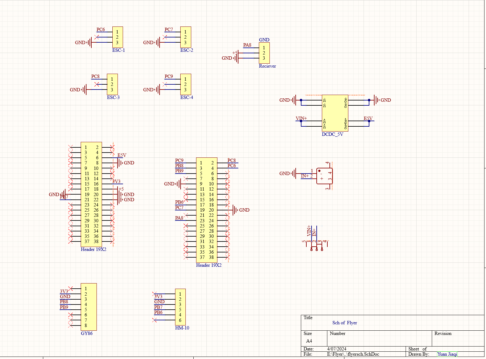
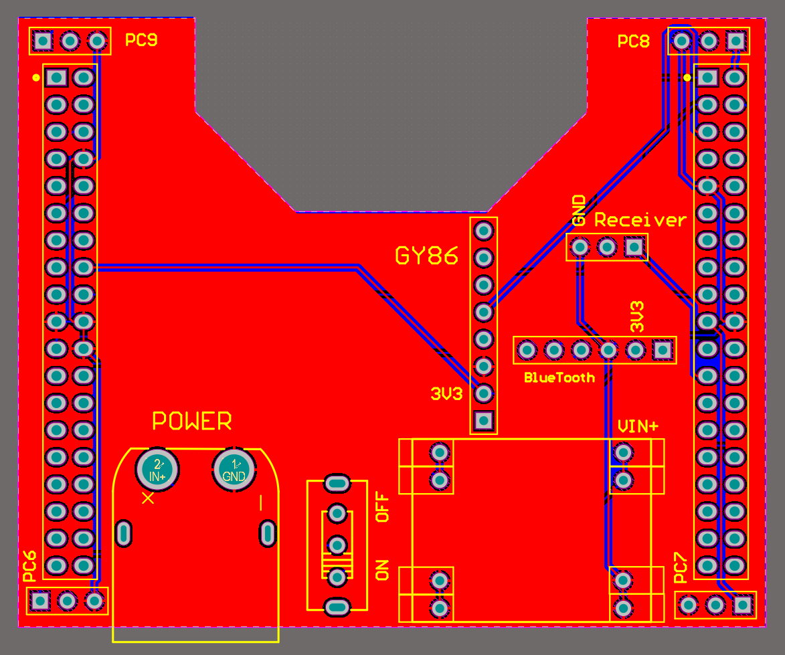
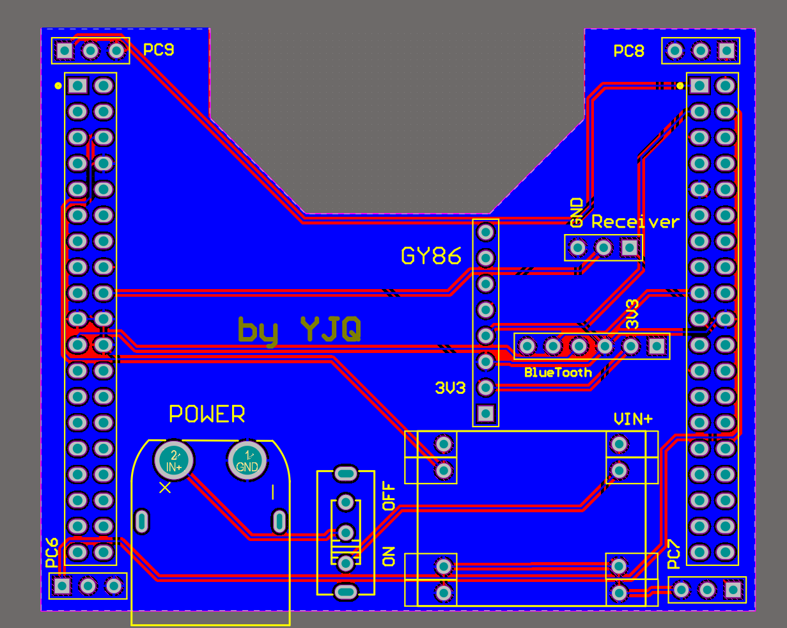

## 四轴无人机课设项目：

这是一个自制四轴无人机工程的代码仓库。

MCU: STM32F401 交叉编译工具链：gnu+arm-none-eabi-gcc  RTOS：uC/OS-II

PID反馈控制：Madgwick + Mahony(本项目最终采用）+ 双环PID控制（角度环+速度环）

使用标准库+寄存器开发，使用makefile构建工程

### 代码结构如下:

* Hardware :相关传感器外设驱动
* Lib :标准固件库
* Records :相关图片和文字记录
* Tools :相关通讯协议和上位机以及云端椭球拟合代码
* Start :与系统初始化相关的启动文件
* User :Main函数与中断
* libc.a libm.a :用到的静态库
* 其他 :makefile、link、以及启动文件

### 效果展示如下：

### 转接板PCB绘制如下:

